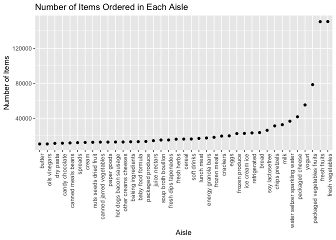

HW 3
================
Malvika Venkataraman
10/17/2021

# Problem 1

``` r
#load data
library(p8105.datasets)
data("instacart")

#View(instacart)
```

## Description of Data

``` r
#understanding the dataset
str(instacart)
```

    ## tibble [1,384,617 × 15] (S3: tbl_df/tbl/data.frame)
    ##  $ order_id              : int [1:1384617] 1 1 1 1 1 1 1 1 36 36 ...
    ##  $ product_id            : int [1:1384617] 49302 11109 10246 49683 43633 13176 47209 22035 39612 19660 ...
    ##  $ add_to_cart_order     : int [1:1384617] 1 2 3 4 5 6 7 8 1 2 ...
    ##  $ reordered             : int [1:1384617] 1 1 0 0 1 0 0 1 0 1 ...
    ##  $ user_id               : int [1:1384617] 112108 112108 112108 112108 112108 112108 112108 112108 79431 79431 ...
    ##  $ eval_set              : chr [1:1384617] "train" "train" "train" "train" ...
    ##  $ order_number          : int [1:1384617] 4 4 4 4 4 4 4 4 23 23 ...
    ##  $ order_dow             : int [1:1384617] 4 4 4 4 4 4 4 4 6 6 ...
    ##  $ order_hour_of_day     : int [1:1384617] 10 10 10 10 10 10 10 10 18 18 ...
    ##  $ days_since_prior_order: int [1:1384617] 9 9 9 9 9 9 9 9 30 30 ...
    ##  $ product_name          : chr [1:1384617] "Bulgarian Yogurt" "Organic 4% Milk Fat Whole Milk Cottage Cheese" "Organic Celery Hearts" "Cucumber Kirby" ...
    ##  $ aisle_id              : int [1:1384617] 120 108 83 83 95 24 24 21 2 115 ...
    ##  $ department_id         : int [1:1384617] 16 16 4 4 15 4 4 16 16 7 ...
    ##  $ aisle                 : chr [1:1384617] "yogurt" "other creams cheeses" "fresh vegetables" "fresh vegetables" ...
    ##  $ department            : chr [1:1384617] "dairy eggs" "dairy eggs" "produce" "produce" ...
    ##  - attr(*, "spec")=
    ##   .. cols(
    ##   ..   order_id = col_integer(),
    ##   ..   product_id = col_integer(),
    ##   ..   add_to_cart_order = col_integer(),
    ##   ..   reordered = col_integer(),
    ##   ..   user_id = col_integer(),
    ##   ..   eval_set = col_character(),
    ##   ..   order_number = col_integer(),
    ##   ..   order_dow = col_integer(),
    ##   ..   order_hour_of_day = col_integer(),
    ##   ..   days_since_prior_order = col_integer(),
    ##   ..   product_name = col_character(),
    ##   ..   aisle_id = col_integer(),
    ##   ..   department_id = col_integer(),
    ##   ..   aisle = col_character(),
    ##   ..   department = col_character()
    ##   .. )

``` r
nrow(instacart)
```

    ## [1] 1384617

``` r
ncol(instacart)
```

    ## [1] 15

``` r
length(unique(instacart$user_id))
```

    ## [1] 131209

``` r
order_1 <- instacart[1,]

order_1$order_id
```

    ## [1] 1

``` r
order_1$product_id
```

    ## [1] 49302

``` r
order_1$add_to_cart_order
```

    ## [1] 1

``` r
order_1$product_name
```

    ## [1] "Bulgarian Yogurt"

The dataset `instacart` records online grocery orders from Instacart
users. It contains 1384617 observations from 131209 unique users. The
dataset has 1384617 rows and 15 columns. Some key variables are as
follows:

-   order\_id: order identifier
-   product\_id: product identifier
-   reordered: coded as 1 if this product has been ordered by the user
    in the past, 0 if otherwise
-   product\_name: name of the product
-   order\_number: the order sequence number for a user (1 = first, n =
    nth)
-   days\_since\_prior\_order: days since the last order, but capped at
    30 days (NA of order\_number = 1)

Let’s take a look at a single row of data. In order 1, user 112108
ordered Bulgarian Yogurt (product id = 49302). The product is from the
dairy eggs department, and was in the yogurt aisle. It was the 1st
product they added to their cart. This user has placed an order 4 times
before, and this product has been previously ordered by them (reordered
= 1). The order was placed on a Thursday (order\_dow = 4), in the 10th
hour of the day (10am), and 9 days since the user last placed an
Instacart order.

### Aisles

``` r
aisle_number = instacart %>% 
  distinct(aisle) %>% 
  nrow()
```

There are 134 aisles.

``` r
most_items_aisle = instacart %>% 
  count(aisle) %>% 
  arrange(desc(n)) %>%
  top_n(3)
```

    ## Selecting by n

The fresh vegetables aisle, is where the most items have been ordered
from. The fresh fruits aisle, is where the second most items have been
ordered from. The packaged vegetables fruits aisle, is where the third
most items have been ordered from.

### Aisles Plot

``` r
aisle_plot = instacart %>%
  count(aisle) %>%
  mutate(aisle = fct_reorder(aisle, desc(n))) %>%
  filter(n > 10000) %>%
  ggplot(aes(x = aisle, y = n)) + geom_point() + labs(title = "Number of Items Ordered in Each Aisle", x = "Aisle", y = "Number of Items") + theme(axis.text.x = element_text(angle = 90, size = rel(1), hjust = 1))

aisle_plot
```

<!-- -->
Add in explanation

### Aisles Table

``` r
three_most_popular = instacart %>%
  filter(aisle == 'baking ingredients' | aisle == 'dog food care' | aisle == 'packaged vegetables fruits') %>%
  group_by(aisle, product_name) %>%
  summarize(
    count = n()) %>%
  top_n(3, count) %>%
  arrange(aisle, desc(count), product_name)
```

    ## `summarise()` has grouped output by 'aisle'. You can override using the `.groups` argument.

``` r
knitr::kable(three_most_popular)
```

| aisle                      | product\_name                                 | count |
|:---------------------------|:----------------------------------------------|------:|
| baking ingredients         | Light Brown Sugar                             |   499 |
| baking ingredients         | Pure Baking Soda                              |   387 |
| baking ingredients         | Cane Sugar                                    |   336 |
| dog food care              | Snack Sticks Chicken & Rice Recipe Dog Treats |    30 |
| dog food care              | Organix Chicken & Brown Rice Recipe           |    28 |
| dog food care              | Small Dog Biscuits                            |    26 |
| packaged vegetables fruits | Organic Baby Spinach                          |  9784 |
| packaged vegetables fruits | Organic Raspberries                           |  5546 |
| packaged vegetables fruits | Organic Blueberries                           |  4966 |

### Pink Lady Apples and Coffee Ice Cream Table

``` r
days_of_week = c("Sunday", "Monday", "Tuesday", "Wednesday", "Thursday", "Friday", "Saturday")

mean_hour_order = instacart %>%
  filter(product_name == "Pink Lady Apples" | product_name == "Coffee Ice Cream") %>%
  select(product_name, order_dow, order_hour_of_day) %>%
  group_by(product_name, order_dow) %>%
  summarize(
    mean_hour = mean(order_hour_of_day)
  ) %>%
  mutate(order_dow = days_of_week[order_dow + 1]) %>%
  pivot_wider(
    names_from = order_dow,
    values_from = mean_hour
  )
```

    ## `summarise()` has grouped output by 'product_name'. You can override using the `.groups` argument.

``` r
knitr::kable(mean_hour_order, 
             digit = 2, 
             col.names = c("Product Name", "Sunday", "Monday", "Tuesday", "Wednesday", "Thursday", "Friday", "Saturday"))
```

| Product Name     | Sunday | Monday | Tuesday | Wednesday | Thursday | Friday | Saturday |
|:-----------------|-------:|-------:|--------:|----------:|---------:|-------:|---------:|
| Coffee Ice Cream |  13.77 |  14.32 |   15.38 |     15.32 |    15.22 |  12.26 |    13.83 |
| Pink Lady Apples |  13.44 |  11.36 |   11.70 |     14.25 |    11.55 |  12.78 |    11.94 |

# Problem 2

## Load Data

``` r
data("brfss_smart2010")

#View(brfss_smart2010)
```

## Data Cleaning

``` r
brfss_data = brfss_smart2010 %>%
  janitor::clean_names() %>%
  filter(topic == "Overall Health") %>%
  mutate(response = factor(response, 
                           levels = c("Poor", "Fair", "Good", "Very Good", "Excellent")))

#View(brfss_data)
```

## 7 or more loactions

``` r
states_2002 = brfss_data %>%
  filter(year == 2002) %>%
  group_by(locationabbr) %>%
  distinct(locationdesc) %>%
  summarize(num_loc = n()) %>%
  filter(num_loc > 6) %>%
  pull(locationabbr)

states_2010 = brfss_data %>%
  filter(year == 2010) %>%
  group_by(locationabbr) %>%
  distinct(locationdesc) %>%
  summarize(num_loc = n()) %>%
  filter(num_loc > 6) %>%
  pull(locationabbr)
```

The states: CT, FL, MA, NC, NJ, PA were observed at 7 or more locations
in 2002. The states: CA, CO, FL, MA, MD, NC, NE, NJ, NY, OH, PA, SC, TX,
WA were observed at 7 or more locations in 2010.

## Excellent Dataset & Plot

Construct a dataset that is limited to Excellent responses, and
contains, year, state, and a variable that averages the data\_value
across locations within a state.

``` r
#construct the dataset
excellent_data = brfss_data %>%
  filter(response == "Excellent") %>%
  select(year, locationabbr, data_value) %>%
  group_by(year, locationabbr) %>%
  summarise(mean_value = mean(data_value, na.rm = T))
```

    ## `summarise()` has grouped output by 'year'. You can override using the `.groups` argument.

``` r
#construct the spaghetti plot
excellent_plot = excellent_data %>%
  ggplot(aes(x = year, y = mean_value, color = locationabbr)) + geom_line(alpha = .5, ) + labs(title = "Average Value Over Time Within a State", y = "Average Value Within a State", color = "States")

excellent_plot
```

<!-- -->

Make a “spaghetti” plot of this average value over time within a state
(that is, make a plot showing a line for each state across years – the
geom\_line geometry and group aesthetic will help). Make a two-panel
plot showing, for the years 2006, and 2010, distribution of data\_value
for responses (“Poor” to “Excellent”) among locations in NY State
